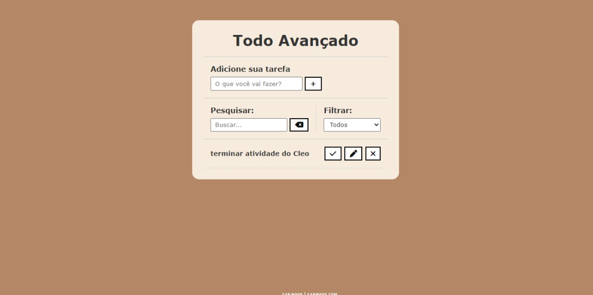

# Objetivo

* O objetivo do projeto é desenvolver uma página de gerenciamento de tarefas, permitindo aos usuários adicionar novas tarefas e filtrá-las com base no status (todas, concluídas e pendentes). Além disso, os usuários têm a opção de pesquisar tarefas específicas. O progresso das tarefas é salvo localmente usando o Local Storage do navegador, garantindo que as informações sejam armazenadas de forma segura e acessíveis mesmo após fechar o navegador.

# Tecnologias utilizadas

| Tecnologia    | Versão    |
|---------------|-----------|
| HTML          |   5       |
| CSS           |   3       |
| MDN WEB DOCS  |   x       |
| GITHUB        |   X       |
| GIT           |   2.37    |
| JAVASCRIPT    |           |

## Fonte consultada

* [vídeo](https://www.youtube.com/watch?v=HSssE1PRQcA)
